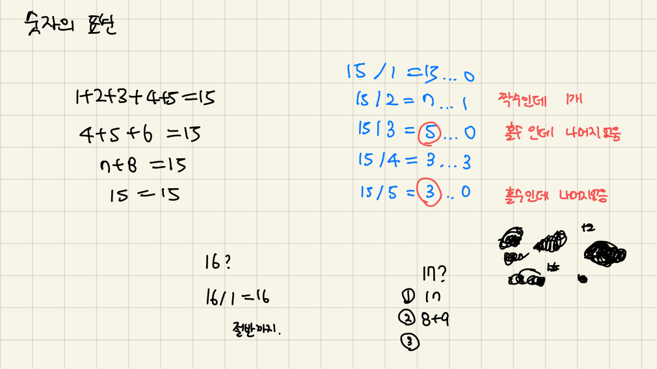
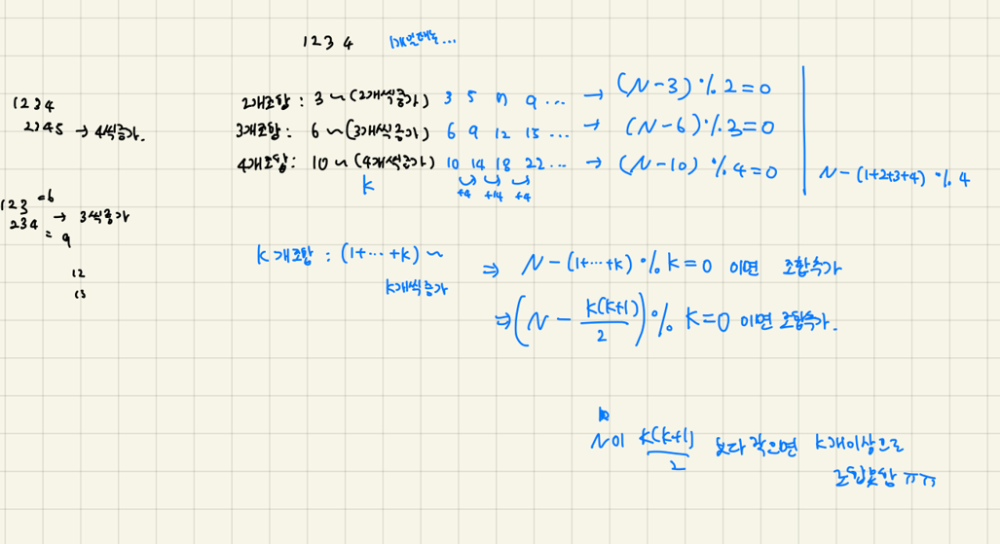

### 문제 파악하기

- 연속된 자연수들로 이루는 건 1개의 숫자로도 가능하다. 즉 n 자신 하나로 표현하기도 포함된다.
- n은 10000이하의 자연수

### 알고리즘을 떠올리기 위한 생각의 흐름..



- 규칙을 찾아보려고 시도
    - 주어진 자연수 n을 1,2,3,..k…(n을 k개의 수로 이룬다) 차례대로 나눗셈을 했을 때 몫과 나머지에 규칙이 있는지 살펴봄 → k가 홀수일 때 나머지가 없으면 가능하다? 근데 다른 경우를 잘 모르겠음.. pass



- `자연수 n`을 `k`개의 수로 이루는 경우를 하나하나 살펴봄
    - `k=3` 개의 수로 이룬다고 가정하면,
        - 1+2+3 = 6
        - 2+3+4 = 9
        - 3+4+5 = 12
    - `k=4` 개의 수로 이룬다고 가정하면,
        - 1+2+3+4=10
        - 2+3+4+5=14
        - 3+4+5+6=18
    - 이런 식으로 `n = 6, 9, 12 …` 의 경우 `k=3` 개의 수로 이루어지는 것이 가능하고
    - `n = 10, 14, 18, …` 의 경우 `k=4` 개의 수로 이루어지는 것이 가능하다. (answer++ 하면 됨)
- 다시 규칙 찾아내기
    - 주어진 `자연수 n`에서 `k`개의 수로 이뤄지는 가장 작은 값(1+..+k)을 빼고, 거기에 k를 나머지 연산한 값이 0이라면 n은 k개의 수로 이뤄질 수 있다. (answer++)
        
        <aside>
        💡 n - (1+2+..+k) % k == 0 이면, 조합이 가능하므로 answer++
        이때 (1+2+..+k)의 합은 `k(k+1)/2` 이다.
        
        </aside>
        
        <aside>
        💡 ex ) 자연수 9를 3개의 숫자로 이룰 수 있는지 확인해보자. 
        9-(1+2+3) % 3 == 0 이므로 가능하다.
        
        </aside>
        
        ```jsx
        if ((n - k(k+1)/2) % k == 0) //이 조건에 부합한다면 n은 k개의 수로 이룰 수 있다.
        	answer++;
        ```
        
    - 1개로 조합하는 경우는 본인 자신 뿐이므로 answer = 1에서 시작
    - k를 늘려가며(k++) k값에 따른 조건의 부합을 따져보고, 조건이 맞다면 answer++;
    - 각 k개의 조합은 (1+2+…+k) 이 최솟값이므로, n은 (1+2+…+k)보다 크거나 같아야 한다.
    - 만약 n이 (1+2+…+k) 보다 작다면 그 때부터는 더 이상 answer을 구할 필요가 없다.(break;)

### 고민중인 것

- 주어진 조건이 n은 10000이하의 숫자이기도 하고, 어차피 중간에 break문을 걸어 놔서 큰 문제는 없었지만 for문의 기본 조건 중 `k<n` 은 너무 많은 범위라고 생각 든다.
- `while`문이 더 적절한 것 같기도… while문에 조건 달려면 위에 변수를 다 빼놓고 조건을 넣어야해서 그냥 k++문을 맨 아래에 넣기 싫어서 for문으로 사용했음…
- 적절한 범위를 알아내고 싶다? 아니 그냥 while 쓰는게 더 맞는 것 같다 ??