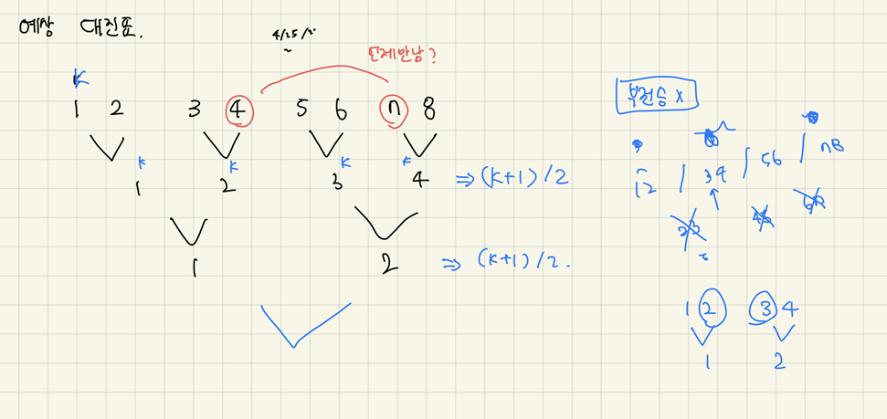

# [level 2] 예상 대진표 - 12985 

[문제 링크](https://school.programmers.co.kr/learn/courses/30/lessons/12985) 

### 살펴볼 조건

- A,B 참가자는 서로 붙게 되기 전까지는 항상 이긴다.
- N은 2의 지수 승으로 부전승은 발생하지 않는다.

### 생각한 알고리즘

- 각 참가자 A, B가 매번 이긴다고 가정하면, A, B의 다음 번호는 `(A+1)/2`, `(B+1)/2` 가 된다.
- 이 과정을 반복하다가,  1. `B-A == 1` 이며 2. `A가 홀수, B가 짝수`일 때 두 참가자가 붙게 된다.
    - 예를 들어 A=2, B=3일 경우 둘은 1 차이지만 각각 [1,2] [3,4] 대진으로 따로 묶인다. 한 번 더 수행해야 한다.
    - A가 B보다 크게 주어질 경우, 각 값을 교환한다.

### 시행착오

- Math.floor() 를 쓰지 않았더니 나눗셈 연산에서 정수가 아닌 실수가 나와서 실패했다.