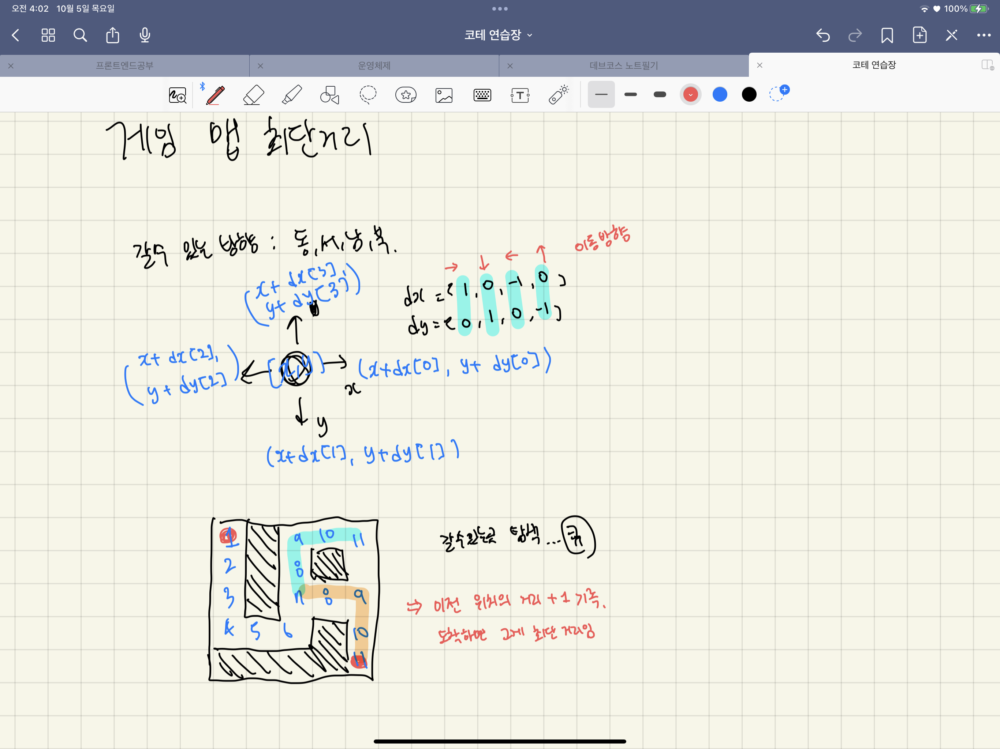

# [level 2] 게임 맵 최단거리 - 1844 

[문제 링크](https://school.programmers.co.kr/learn/courses/30/lessons/1844) 

### 성능 요약

메모리: 34.6 MB, 시간: 3.20 ms

### 구분

코딩테스트 연습 > 깊이／너비 우선 탐색（DFS／BFS）

### 채점결과

정확성: 69.9<br/>효율성: 30.1<br/>합계: 100.0 / 100.0

### 문제 설명

<p>ROR 게임은 두 팀으로 나누어서 진행하며, 상대 팀 진영을 먼저 파괴하면 이기는 게임입니다. 따라서, 각 팀은 상대 팀 진영에 최대한 빨리 도착하는 것이 유리합니다. </p>

<p>지금부터 당신은 한 팀의 팀원이 되어 게임을 진행하려고 합니다. 다음은 5 x 5 크기의 맵에, 당신의 캐릭터가 (행: 1, 열: 1) 위치에 있고, 상대 팀 진영은 (행: 5, 열: 5) 위치에 있는 경우의 예시입니다.</p>

<p></p>

<p>위 그림에서 검은색 부분은 벽으로 막혀있어 갈 수 없는 길이며, 흰색 부분은 갈 수 있는 길입니다. 캐릭터가 움직일 때는 동, 서, 남, 북 방향으로 한 칸씩 이동하며, 게임 맵을 벗어난 길은 갈 수 없습니다.<br>
아래 예시는 캐릭터가 상대 팀 진영으로 가는 두 가지 방법을 나타내고 있습니다.</p>

<ul>
<li>첫 번째 방법은 11개의 칸을 지나서 상대 팀 진영에 도착했습니다.</li>
</ul>

<p></p>

<ul>
<li>두 번째 방법은 15개의 칸을 지나서 상대팀 진영에 도착했습니다.</li>
</ul>

<p></p>

<p>위 예시에서는 첫 번째 방법보다 더 빠르게 상대팀 진영에 도착하는 방법은 없으므로, 이 방법이 상대 팀 진영으로 가는 가장 빠른 방법입니다.</p>

<p>만약, 상대 팀이 자신의 팀 진영 주위에 벽을 세워두었다면 상대 팀 진영에 도착하지 못할 수도 있습니다. 예를 들어, 다음과 같은 경우에 당신의 캐릭터는 상대 팀 진영에 도착할 수 없습니다.</p>

<p></p>

<p>게임 맵의 상태 maps가 매개변수로 주어질 때, 캐릭터가 상대 팀 진영에 도착하기 위해서 지나가야 하는 칸의 개수의 <strong>최솟값</strong>을 return 하도록 solution 함수를 완성해주세요. 단, 상대 팀 진영에 도착할 수 없을 때는 -1을 return 해주세요.</p>

<h5>제한사항</h5>

<ul>
<li>maps는 n x m 크기의 게임 맵의 상태가 들어있는 2차원 배열로, n과 m은 각각 1 이상 100 이하의 자연수입니다.

<ul>
<li>n과 m은 서로 같을 수도, 다를 수도 있지만, n과 m이 모두 1인 경우는 입력으로 주어지지 않습니다.</li>
</ul></li>
<li>maps는 0과 1로만 이루어져 있으며, 0은 벽이 있는 자리, 1은 벽이 없는 자리를 나타냅니다.</li>
<li>처음에 캐릭터는 게임 맵의 좌측 상단인 (1, 1) 위치에 있으며, 상대방 진영은 게임 맵의 우측 하단인 (n, m) 위치에 있습니다.</li>
</ul>

<hr>

<h5>입출력 예</h5>
<table class="table">
        <thead><tr>
<th>maps</th>
<th>answer</th>
</tr>
</thead>
        <tbody><tr>
<td>[[1,0,1,1,1],[1,0,1,0,1],[1,0,1,1,1],[1,1,1,0,1],[0,0,0,0,1]]</td>
<td>11</td>
</tr>
<tr>
<td>[[1,0,1,1,1],[1,0,1,0,1],[1,0,1,1,1],[1,1,1,0,0],[0,0,0,0,1]]</td>
<td>-1</td>
</tr>
</tbody>
      </table>
<h5>입출력 예 설명</h5>

<p>입출력 예 #1<br>
주어진 데이터는 다음과 같습니다.</p>

<p></p>

<p>캐릭터가 적 팀의 진영까지 이동하는 가장 빠른 길은 다음 그림과 같습니다.</p>

<p></p>

<p>따라서 총 11칸을 캐릭터가 지나갔으므로 11을 return 하면 됩니다.</p>

<p>입출력 예 #2<br>
문제의 예시와 같으며, 상대 팀 진영에 도달할 방법이 없습니다. 따라서 -1을 return 합니다.</p>


> 출처: 프로그래머스 코딩 테스트 연습, https://programmers.co.kr/learn/challenges

---


### 살펴볼 조건
- 최단거리 탐색 : DFS? BFS? DFS는 처음 발견되는 답이 최단거리가 아닐 수도 있기에 전부 탐색해야하지만, BFS는 현재 노드에서 가까운 곳부터 찾기 때문에 도착점에 도달한 순간 곧 해답이므로 탐색을 종료해도 된다.
- 동,서,남,북 방향으로 움직일 수 있다.
- 도착할 수 없다면 -1 리턴


### 생각한 알고리즘



- 최단 거리 탐색을 위해 BFS 사용. 큐를 이용한다.
- 시작 지점에서 각 구역[y,x] 까지 걸리는 최단 시간을 기록해주는 checked 배열을 만든다. 0으로 초기화한다.
- 현재 위치에서 가장 근접한 곳(4방향)을 탐색한 후, 갈 수 있는 곳이라면 큐에 넣는다.
    - 동, 서 남, 북 총 4방향으로 움직일 수 있으므로, 방향벡터 `dx=[1,0,-1,0]` , `dy=[0,1,0,-1]` 을 통해 현재 위치 [x,y] ⇒ 다음 위치 [x+dx[i], y+dy[i]] 로 탐색한다.
    - 1. row, col 범위를 벗어나는지, 2. 벽으로 막혔는지, 3. 이미 방문했는지 체크한다. 만약 조건이 하나라도 해당된다면 다음 위치는 탐색 할 수 없는 구역이므로 continue;
    - 그게 아니라면 탐색 할 수 있는 구역이므로 queue에 위치를 삽입한다.
    - 그리고 `해당 구역(nextY, nextX)`까지 가는 최단거리를 `현재거리(y,x) + 1`로 업데이트한다.
- 만약 큐가 종료 되었는데도 경로를 찾지 못했다면 -1 리턴


### 코드

```jsx
function solution(maps) {
    var answer = 0;
    const dx = [1,0,-1,0]; //오른쪽, 아래, 왼쪽, 위
    const dy = [0,1,0,-1]; //오른쪽, 아래, 왼쪽, 위
    const [row, col] = [maps.length, maps[0].length]; //행, 열 크기
    
    const checked = Array(maps.length).fill(0).map(()=> Array(maps[0].length).fill(0)); //해당 지점까지 가는데 걸린 최단 거리 기록
    var queue = []; //BFS를 위한 큐
    
    //아예 시작부터 막힌경우 
    if(maps[row-1][col-2] == 0 && maps[row-2][col-1] == 0) 
        return -1;
    
    queue.push([0,0]); //시작점
    checked[0][0] = 1; //방문 체크
    
    while(queue.length > 0) {
        var [y, x] = queue.shift();
        
        //도착지에 도달한 경우
        if(y === row-1 && x === col-1) {
            return checked[y][x]; //최단 거리 return
        }
        
        //오른쪽, 아래, 왼쪽 위로 이동할 수 있으므로 각 경우에 대해 탐색
        for(var i=0;i<4;i++){
            let nextX = x+dx[i];
            let nextY = y+dy[i];
            //갈 수 있는 범위인지 체크
            if(nextX >= col || nextX < 0 || nextY >= row || nextY < 0 )
                continue;
            //벽 체크, 방문 체크
            if(maps[nextY][nextX] == 0 || checked[nextY][nextX] > 0)
                continue;
            //갈 수 있는 곳이라면
            queue.push([nextY, nextX]);
            checked[nextY][nextX] = checked[y][x]+1; // 해당 지점까지 가는데 걸리는 최단 거리 업데이트
        }
    }
    //도착지에 못 도착한 경우
    return -1;
}
```