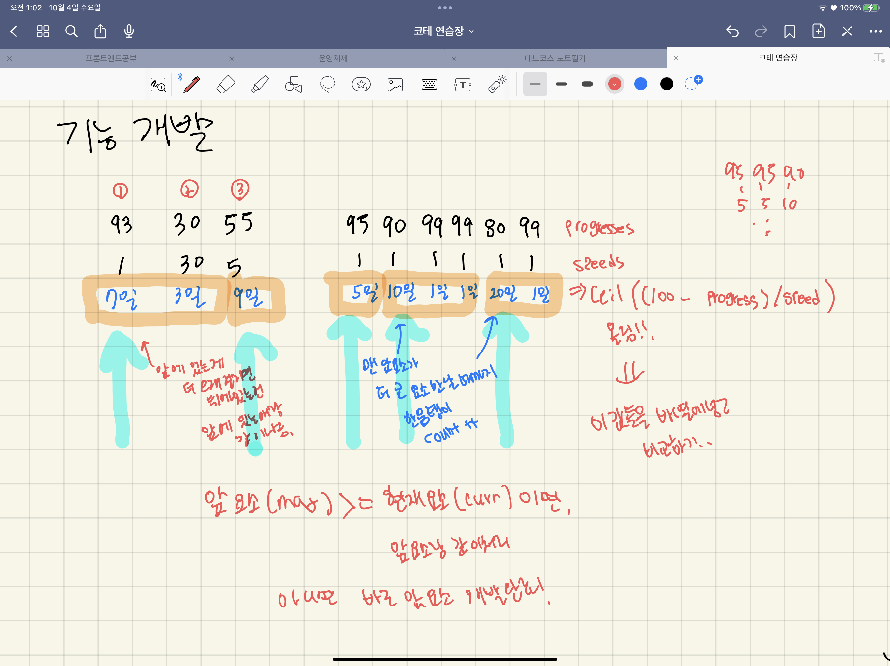

# [level 2] 기능개발 - 42586 

[문제 링크](https://school.programmers.co.kr/learn/courses/30/lessons/42586?language=javascript) 

### 성능 요약

메모리: 33.4 MB, 시간: 0.07 ms

### 구분

코딩테스트 연습 > 스택／큐

### 채점결과

정확성: 100.0<br/>합계: 100.0 / 100.0

### 문제 설명

<p>프로그래머스 팀에서는 기능 개선 작업을 수행 중입니다. 각 기능은 진도가 100%일 때 서비스에 반영할 수 있습니다.</p>

<p>또, 각 기능의 개발속도는 모두 다르기 때문에 뒤에 있는 기능이 앞에 있는 기능보다 먼저 개발될 수 있고, 이때 뒤에 있는 기능은 앞에 있는 기능이 배포될 때 함께 배포됩니다.</p>

<p>먼저 배포되어야 하는 순서대로 작업의 진도가 적힌 정수 배열 progresses와 각 작업의 개발 속도가 적힌 정수 배열 speeds가 주어질 때 각 배포마다 몇 개의 기능이 배포되는지를 return 하도록 solution 함수를 완성하세요.</p>

<h5>제한 사항</h5>

<ul>
<li>작업의 개수(progresses, speeds배열의 길이)는 100개 이하입니다.</li>
<li>작업 진도는 100 미만의 자연수입니다.</li>
<li>작업 속도는 100 이하의 자연수입니다.</li>
<li>배포는 하루에 한 번만 할 수 있으며, 하루의 끝에 이루어진다고 가정합니다. 예를 들어 진도율이 95%인 작업의 개발 속도가 하루에 4%라면 배포는 2일 뒤에 이루어집니다.</li>
</ul>

<h5>입출력 예</h5>
<table class="table">
        <thead><tr>
<th>progresses</th>
<th>speeds</th>
<th>return</th>
</tr>
</thead>
        <tbody><tr>
<td>[93, 30, 55]</td>
<td>[1, 30, 5]</td>
<td>[2, 1]</td>
</tr>
<tr>
<td>[95, 90, 99, 99, 80, 99]</td>
<td>[1, 1, 1, 1, 1, 1]</td>
<td>[1, 3, 2]</td>
</tr>
</tbody>
      </table>
<h5>입출력 예 설명</h5>

<p>입출력 예 #1<br>
첫 번째 기능은 93% 완료되어 있고 하루에 1%씩 작업이 가능하므로 7일간 작업 후 배포가 가능합니다.<br>
두 번째 기능은 30%가 완료되어 있고 하루에 30%씩 작업이 가능하므로 3일간 작업 후 배포가 가능합니다. 하지만 이전 첫 번째 기능이 아직 완성된 상태가 아니기 때문에 첫 번째 기능이 배포되는 7일째 배포됩니다.<br>
세 번째 기능은 55%가 완료되어 있고 하루에 5%씩 작업이 가능하므로 9일간 작업 후 배포가 가능합니다. </p>

<p>따라서 7일째에 2개의 기능, 9일째에 1개의 기능이 배포됩니다.</p>

<p>입출력 예 #2<br>
모든 기능이 하루에 1%씩 작업이 가능하므로, 작업이 끝나기까지 남은 일수는 각각 5일, 10일, 1일, 1일, 20일, 1일입니다. 어떤 기능이 먼저 완성되었더라도 앞에 있는 모든 기능이 완성되지 않으면 배포가 불가능합니다.</p>

<p>따라서 5일째에 1개의 기능, 10일째에 3개의 기능, 20일째에 2개의 기능이 배포됩니다.</p>

<p>※ 공지 - 2020년 7월 14일 테스트케이스가 추가되었습니다.</p>


> 출처: 프로그래머스 코딩 테스트 연습, https://programmers.co.kr/learn/challenges


---


### 살펴볼 조건

- progresses 와 speeds는 먼저 배포되어야 하는 순서대로 정렬되어있다.
- 뒤에 있는 기능이 앞에 있는 기능보다 먼저 개발될 수 있지만, 앞에 있는 기능이 배포될 때 함께 배포된다. (먼저 개발했다고 먼저 배포 불가능)
- 길이는 100개 이하


### 생각한 알고리즘



- 우선 각 기능이 개발에 걸리는 시간을 구한다.
    - ex ) 현재 30% 완료되어있고, 하루에 30%씩 작업 가능한 경우
    - (100-30) / 30 = [2.xxx](http://2.xxx) << 올림하면 3일!
    - `Math.ceil((100 - progress) / speed)`
- 아무리 앞 기능보다 뒷 기능 개발 시간이 짧게 걸려도, 앞 기능이 완료되기 전에는 배포될 수 없다. 킵!!
    - 앞 기능보다 뒷 기능 개발 시간이 더 오래 걸리면, 그 이전까지의 기능들은 한꺼번에 배포된다.
    - 예를 들어 [5일, 10일, 1일, 1일, 20일, 1일]이 걸린다면,
        1. 5일 `(index=0)` < 10일`(index=1)` 이므로 5일짜리 배포 `가능`
        ⇒  [ `1개` ] 배포 완료
        2. 10일`(index=1)` ≥ 1일`(index=2)` 이므로 10일짜리 끝나기 전까진 1일 배포 `불가능` 
        ⇒ [ `2개` ] 배포 대기 중… |  [ `1개` ]배포 완료
        3. 10일`(index=1)` ≥ 1일`(index=3)` 이므로 10일짜리 끝나기 전까진 1일 배포 `불가능`
        ⇒ [ `3개` 배포 대기 중…] | [ `1개` 배포 완료]
        4. 10일`(index=1)` < 20일`(index=4)` 이므로 10일짜리와 함께 배포 대기 중인 것 배포 `가능`
        ⇒ [ `1개` 배포 대기 중…] | [ `1개` 배포 완료, `3개` 배포 완료]
        5. 20일`(index=1)` ≥ 1일`(index=4)` 이므로 20일짜리 끝나기 전까진 1일 배포 `불가능`
        ⇒ [ `2개` 배포 대기 중…] | [ `1개` 배포 완료, `3개` 배포 완료]
        6. 이제 더 비교할 배열의 요소가 없으므로 배포 대기중인 `2개` 배포 `가능`
        ⇒  [ `1개` 배포 완료, `3개` 배포 완료, `2개` 배포 완료]

### 코드

```jsx
function solution(progresses, speeds) {
    var answer = [];
    let times = [];

    //각 progress가 완성되는데 걸리는 날짜(시간)를 계산해서 배열에 넣는다.
    progresses.forEach((progress, index) => {
        times.push(Math.ceil((100-progress)/speeds[index])); //올림처리
    });
    
    let maxTime = times[0]; //가장 오래 걸리는 time
    let count = 0; //하루에 같이 처리되는 progress의 개수
    
    times.forEach((time, index) => {
        if(maxTime >= time) { //만약 앞의 progress가 아직 안 끝난 상태라면
            count++; //한번에 처리할 양 +1
        }
        else { //앞의 progress가 끝난 상태면 
            answer.push(count); //한번에 처리해야할 progress 개수 넣기
            count = 1;//현재 progress부터 다시 시작하므로 1로 초기화
            maxTime = time; // 현재 progress가 걸리는 시간으로 max값 초기화
        }
    }) 
    answer.push(count); //마지막으로 한번에 처리할 양 넣기
    return answer;
}
```