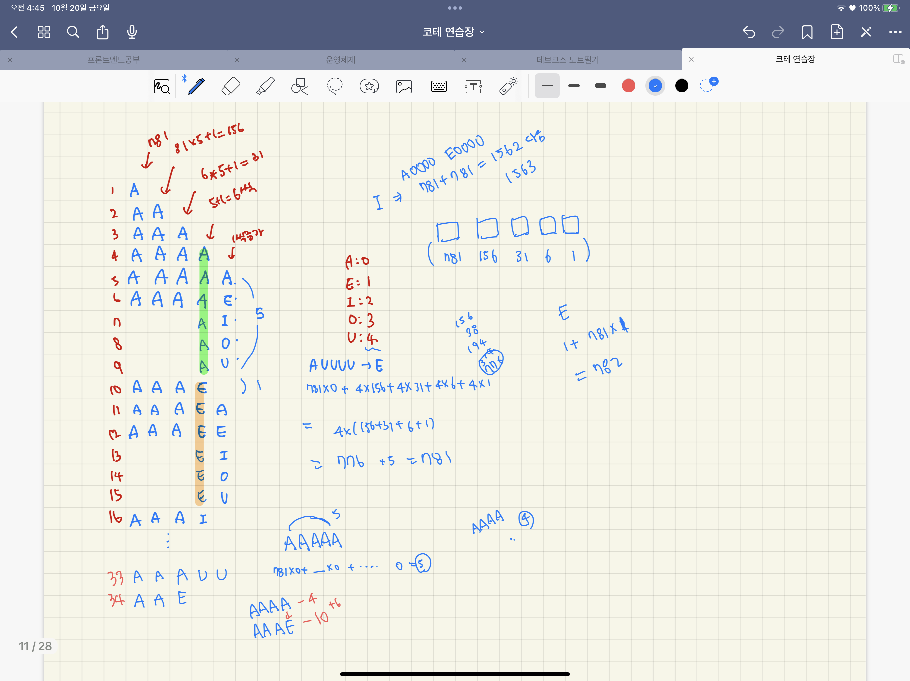

# [level 2] 모음 사전 - 84512 

[문제 링크](https://school.programmers.co.kr/learn/courses/30/lessons/84512?language=javascript) 

### 성능 요약

메모리: 33.4 MB, 시간: 0.07 ms

### 구분

코딩테스트 연습 > 완전탐색

### 채점결과

정확성: 100.0<br/>합계: 100.0 / 100.0

### 제출 일자

2023년 10월 5일 3:48:40

### 문제 설명

<p>사전에 알파벳 모음 'A', 'E', 'I', 'O', 'U'만을 사용하여 만들 수 있는, 길이 5 이하의 모든 단어가 수록되어 있습니다. 사전에서 첫 번째 단어는 "A"이고, 그다음은 "AA"이며, 마지막 단어는 "UUUUU"입니다.</p>

<p>단어 하나 word가 매개변수로 주어질 때, 이 단어가 사전에서 몇 번째 단어인지 return 하도록 solution 함수를 완성해주세요.</p>

<h5>제한사항</h5>

<ul>
<li>word의 길이는 1 이상 5 이하입니다.</li>
<li>word는 알파벳 대문자 'A', 'E', 'I', 'O', 'U'로만 이루어져 있습니다.</li>
</ul>

<hr>

<h5>입출력 예</h5>
<table class="table">
        <thead><tr>
<th>word</th>
<th>result</th>
</tr>
</thead>
        <tbody><tr>
<td><code>"AAAAE"</code></td>
<td>6</td>
</tr>
<tr>
<td><code>"AAAE"</code></td>
<td>10</td>
</tr>
<tr>
<td><code>"I"</code></td>
<td>1563</td>
</tr>
<tr>
<td><code>"EIO"</code></td>
<td>1189</td>
</tr>
</tbody>
      </table>
<h5>입출력 예 설명</h5>

<p>입출력 예 #1</p>

<p>사전에서 첫 번째 단어는 "A"이고, 그다음은 "AA", "AAA", "AAAA", "AAAAA", "AAAAE", ... 와 같습니다. "AAAAE"는 사전에서 6번째 단어입니다.</p>

<p>입출력 예 #2</p>

<p>"AAAE"는  "A", "AA", "AAA", "AAAA", "AAAAA", "AAAAE", "AAAAI", "AAAAO", "AAAAU"의 다음인 10번째 단어입니다.</p>

<p>입출력 예 #3</p>

<p>"I"는 1563번째 단어입니다.</p>

<p>입출력 예 #4</p>

<p>"EIO"는 1189번째 단어입니다.</p>


> 출처: 프로그래머스 코딩 테스트 연습, https://school.programmers.co.kr/learn/challenges


---

### 생각한 알고리즘 ...


| A→A | 0 |
| --- | --- |
| A→E | 1 |
| A→I | 2 |
| A→O | 3 |
| A→U | 4 |
- 각 모음이 바뀌는 순서. AEIOU 순서대로 바뀐다.

| 0번째 글자 | 1번째 글자 | 2번째 글자 | 3번째 글자 | 4번째 글자 |
| --- | --- | --- | --- | --- |
| 781 | 156 | 31 | 6 | 1 |
- 알파벳이 A→E, E→I, … 즉 다음 단계 모음으로 바뀌는 때까지의 변화량
- 문자열의 각 위치마다 달라진다.



- 사전은 1번부터 시작하고, 알파벳의 위치에 따라서 증가하는 횟수가 다르다.
- 맨 마지막 글자의 경우, 알파벳이 변화하는 주기는 `1`이다.
- 맨 마지막에서 두번째 글자의 경우, 알파벳이 변화하는 주기는 `5+1=6` 이다.
	- 순서대로 [A,E,I,O,U,공백]이라서 6!
- 맨 마지막에서 세번째 글자의 경우, 알파벳이 변화하는 주기는 `6*5+1=31` 이다.
- 이런식으로 구하면 각 인덱스에 따른 알파벳이 변화하는 주기는 `[781, 156, 31, 6, 1]` 이다.
- 이때, 변화하는 주기를 통해 사전 순서를 알아내려면, 주어진 문자열의 길이에 따라 비교 대상이 달라진다.
	- `AAAE` 는 `AAAA`와 비교해서 변화량을 측정해야한다. 
		- AAAA의 사전 순서 = 4
		- AAAE의 사전 순서 = 10
		- 즉, 4번째 글자의 경우 변화하는 주기가 6이고, 처음 시작점이 될 문자열(AAAA)의 순서는 곧 문자열의 길이(word.length = 4)다.
		- `모음 알파벳 순서(A:0 ~ U:4) * index에 따른 변화량  + 문자열의 길이`
	- `E` 는 `A`와 비교해서 변화량을 측정해야한다.
		- A의 사전 순서 = 1 (즉, A의 문자열 길이)
		- 1번째 글자의 경우, 변화하는 주기가 781이므로, 781(1번째 글자의 변화량) * 1(E:1) + 1(문자열길이) = 782
	- `AAAAE`는 `AAAAA`와 비교해서 변화량을 측정해야한다. 
		- AAAAA의 사전 순서 = 5 (즉, AAAAA의 문자열 길이)
		- AAAAE의 사전 순서 = 6
		- 5번째 글자의 변화하는 주기는 1이므로, 1*1+5 = 6
- 어차피 변화가 없으면 A:0 이므로 변화량은 자동으로 계산 x


### JS 코드

```jsx
function solution(word) {
    var answer = 0;
    
    const map = new Map(); //A,E,I,O,U 순서대로 +1
    map.set('A', 0)
    map.set('E', 1)
    map.set('I', 2)
    map.set('O', 3)
    map.set('U', 4)
    
    const weight = [781, 156, 31, 6, 1] // 가장 앞 글자가 바뀔땐 781씩, 가장 맨 뒤 글자는 바뀔때마다 1씩 바뀜.
    const arr = [...word]
    arr.forEach((char, index) => {
        const alpha = map.get(char) // 현재 알파벳을 구한 뒤
        answer += weight[index] * alpha // 현재 글자가 몇번째 위치에 있느냐에 따라 알파벳에 가중치를 곱해야한다.
    })
    answer += word.length // 처음 비교할 문자가 A, AA, AAA, AAAA, AAAAA이냐에 따라 다름... 주어진 문자가 1글자면 A랑 비교하면 되고, 3글자면 AAA랑 비교해야함~
    
    return answer;
}
```

### C++ 코드

```cpp
#include <string>
#include <vector>
#include <algorithm>
using namespace std;

int solution(string word) {
    int answer = 0;
    string str = "AEIOU";
    int num[5] = {781, 156, 31, 6, 1};
    answer = word.length();
    for(int i=0;i<word.length();i++) {
        int idx = str.find(word[i]);
        answer += idx * num[i];
    }
    return answer;
}
```