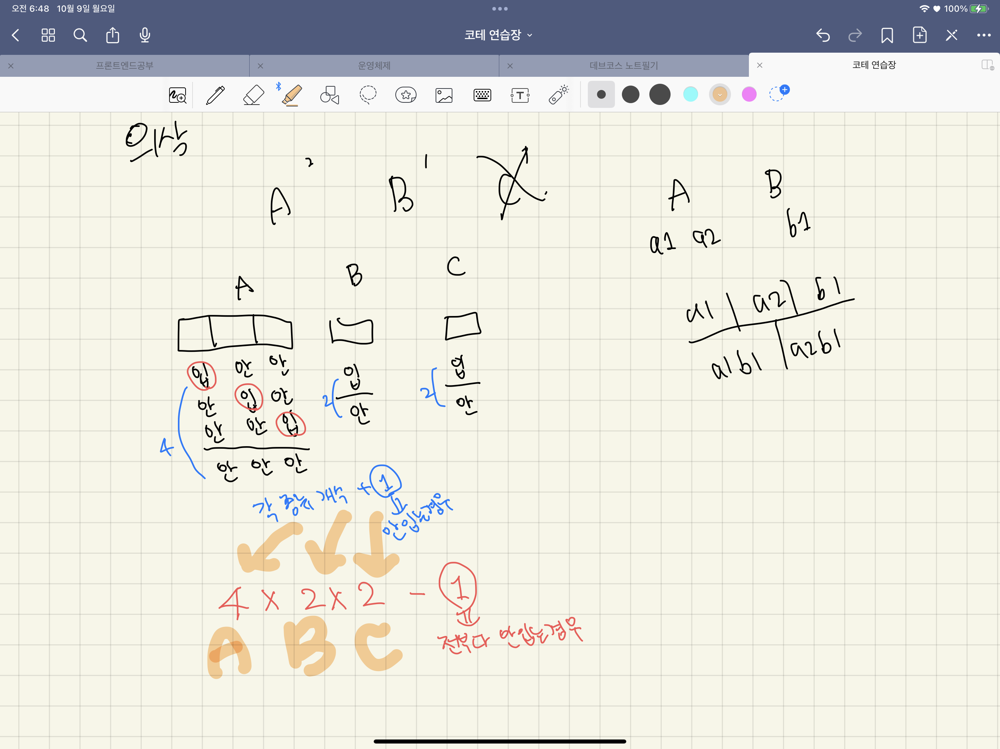

# [level 2] 의상 - 42578 

[문제 링크](https://school.programmers.co.kr/learn/courses/30/lessons/42578?language=cpp) 

### 성능 요약

메모리: 4.14 MB, 시간: 0.02 ms

### 구분

코딩테스트 연습 > 해시

### 채점결과

정확성: 100.0<br/>합계: 100.0 / 100.0

### 문제 설명

<p>코니는 매일 다른 옷을 조합하여 입는것을 좋아합니다.</p>

<p>예를 들어 코니가 가진 옷이 아래와 같고, 오늘 코니가 동그란 안경, 긴 코트, 파란색 티셔츠를 입었다면 다음날은 청바지를 추가로 입거나 동그란 안경 대신 검정 선글라스를 착용하거나 해야합니다.</p>
<table class="table">
        <thead><tr>
<th>종류</th>
<th>이름</th>
</tr>
</thead>
        <tbody><tr>
<td>얼굴</td>
<td>동그란 안경, 검정 선글라스</td>
</tr>
<tr>
<td>상의</td>
<td>파란색 티셔츠</td>
</tr>
<tr>
<td>하의</td>
<td>청바지</td>
</tr>
<tr>
<td>겉옷</td>
<td>긴 코트</td>
</tr>
</tbody>
      </table>
<ul>
<li>코니는 각 종류별로 최대 1가지 의상만 착용할 수 있습니다. 예를 들어 위 예시의 경우 동그란 안경과 검정 선글라스를 동시에 착용할 수는 없습니다. </li>
<li>착용한 의상의 일부가 겹치더라도, 다른 의상이 겹치지 않거나, 혹은 의상을 추가로 더 착용한 경우에는 서로 다른 방법으로 옷을 착용한 것으로 계산합니다.</li>
<li>코니는 하루에 최소 한 개의 의상은 입습니다.</li>
</ul>

<p>코니가 가진 의상들이 담긴 2차원 배열 clothes가 주어질 때 서로 다른 옷의 조합의 수를 return 하도록 solution 함수를 작성해주세요.</p>

<hr>

<h5>제한사항</h5>

<ul>
<li>clothes의 각 행은 [의상의 이름, 의상의 종류]로 이루어져 있습니다.</li>
<li>코니가 가진 의상의 수는 1개 이상 30개 이하입니다.</li>
<li>같은 이름을 가진 의상은 존재하지 않습니다.</li>
<li>clothes의 모든 원소는 문자열로 이루어져 있습니다.</li>
<li>모든 문자열의 길이는 1 이상 20 이하인 자연수이고 알파벳 소문자 또는 '_' 로만 이루어져 있습니다.</li>
</ul>

<h5>입출력 예</h5>
<table class="table">
        <thead><tr>
<th>clothes</th>
<th>return</th>
</tr>
</thead>
        <tbody><tr>
<td>[["yellow_hat", "headgear"], ["blue_sunglasses", "eyewear"], ["green_turban", "headgear"]]</td>
<td>5</td>
</tr>
<tr>
<td>[["crow_mask", "face"], ["blue_sunglasses", "face"], ["smoky_makeup", "face"]]</td>
<td>3</td>
</tr>
</tbody>
      </table>
<h5>입출력 예 설명</h5>

<p>예제 #1<br>
headgear에 해당하는 의상이 yellow_hat, green_turban이고 eyewear에 해당하는 의상이 blue_sunglasses이므로 아래와 같이 5개의 조합이 가능합니다.</p>
<div class="highlight"><pre class="codehilite"><code>1. yellow_hat
2. blue_sunglasses
3. green_turban
4. yellow_hat + blue_sunglasses
5. green_turban + blue_sunglasses
</code></pre></div>
<p>예제 #2<br>
face에 해당하는 의상이 crow_mask, blue_sunglasses, smoky_makeup이므로 아래와 같이 3개의 조합이 가능합니다.</p>
<div class="highlight"><pre class="codehilite"><code>1. crow_mask
2. blue_sunglasses
3. smoky_makeup
</code></pre></div>
<hr>

<p>※ 공지 - 2023년 4월 21일 문제 지문이 리뉴얼되었습니다.</p>


> 출처: 프로그래머스 코딩 테스트 연습, https://programmers.co.kr/learn/challenges


---


### 살펴볼 조건

- 종류 별로 최대 1가지 의상만 착용 가능 => 각 종류별로 아예 안입는 거나, 입거나 둘 중 하나
- 최소 한 개의 의상은 입는다 => 아무것도 안입는 건 불가능


### 알고리즘



- 각 종류 별로 (옷의 개수+1)이 나올 수 있는 경우의 수가 된다.
    - A 2벌(a1, a2), B 1벌(b1)의 경우
    - A는 (a1입기, a2입기), 안입기 총 3가지
    - B는 b1입기, 안입기 총 2가지
- 각 종류 별 경우의 수를 전부 곱하면 모든 경우의 수가 나온다.
- 이때, 아무것도 안 입는 경우는 제외해야 한다.
    - [a1, a2, b1, a1b1, a2b1]
    - 3 * 2 -1 = 총 5가지


### JS 코드

```jsx
function solution(clothes) {
    let answer = 1;
    const map = new Map();

    clothes.map(cloth=>cloth[1]).forEach((type, index)=> { //각 종류별 의상 개수 구하기
        map.set(type,(map.get(type)||0)+1)
    })
    
    for(const value of map.values()) {
        answer *= value+1; //아예 안 입는 경우+1
    }
    
    return answer-1; //최소 한 개의 의상은 입어야 하므로 전부 안 입는 경우 제외
}
```


### C++ 코드

```cpp
#include <string>
#include <vector>
#include <unordered_map>

using namespace std;

int solution(vector<vector<string>> clothes) {
	int answer = 1;
	unordered_map<string, int> clothes_map; // {옷의 종류, 갯수}
	vector<string> clothes_type; //옷의 종류

	for(vector<string> v : clothes) {
    //map에 key(종류) 존재하면
    if(clothes_map.find(v[1]) != clothes_map.end()) {
        clothes_map[v[1]]++;
    }
    else {
        clothes_map.insert(make_pair(v[1],1)); 
        clothes_type.push_back(v[1]);
	   }
	}

	int count = clothes_type.size();
	for(int i = 0; i<count; i++) {
    answer *= clothes_map[clothes_type[i]]+1; // 입는 경우(각 종류의 의상 개수) + 이 종류의 옷을 아예 입지 않는경우
	}
	return answer-1; //전부 안 입는 경우 제외
}
```