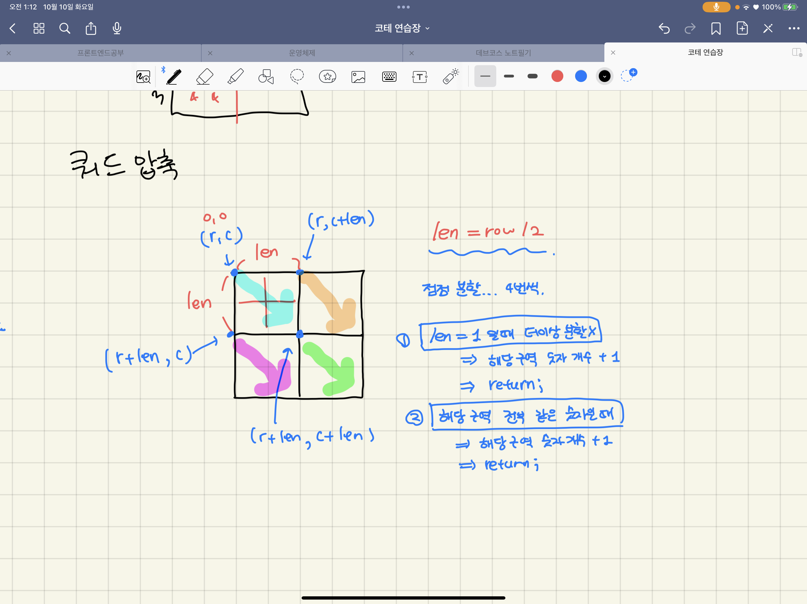

# [level 2] 쿼드압축 후 개수 세기 - 68936 

[문제 링크](https://school.programmers.co.kr/learn/courses/30/lessons/68936?language=cpp) 

### 성능 요약

메모리: 14.6 MB, 시간: 1.48 ms

### 구분

코딩테스트 연습 > 월간 코드 챌린지 시즌1

### 채점결과

정확성: 100.0<br/>합계: 100.0 / 100.0

### 제출 일자

2023년 10월 2일 0:57:18

### 문제 설명

<p>0과 1로 이루어진 2<sup>n</sup> x 2<sup>n</sup> 크기의 2차원 정수 배열 arr이 있습니다. 당신은 이 arr을 <a href="https://en.wikipedia.org/wiki/Quadtree" target="_blank" rel="noopener">쿼드 트리</a>와 같은 방식으로 압축하고자 합니다. 구체적인 방식은 다음과 같습니다.</p>

<ol>
<li>당신이 압축하고자 하는 특정 영역을 S라고 정의합니다.</li>
<li>만약 S 내부에 있는 모든 수가 같은 값이라면, S를 해당 수 하나로 압축시킵니다.</li>
<li>그렇지 않다면, S를 정확히 4개의 균일한 정사각형 영역(입출력 예를 참고해주시기 바랍니다.)으로 쪼갠 뒤, 각 정사각형 영역에 대해 같은 방식의 압축을 시도합니다.</li>
</ol>

<p>arr이 매개변수로 주어집니다. 위와 같은 방식으로 arr을 압축했을 때, 배열에 최종적으로 남는 0의 개수와 1의 개수를 배열에 담아서 return 하도록 solution 함수를 완성해주세요.</p>

<hr>

<h5>제한사항</h5>

<ul>
<li>arr의 행의 개수는 1 이상 1024 이하이며, 2의 거듭 제곱수 형태를 하고 있습니다. 즉, arr의 행의 개수는 1, 2, 4, 8, ..., 1024 중 하나입니다.

<ul>
<li>arr의 각 행의 길이는 arr의 행의 개수와 같습니다. 즉, arr은 정사각형 배열입니다.</li>
<li>arr의 각 행에 있는 모든 값은 0 또는 1 입니다.</li>
</ul></li>
</ul>

<hr>

<h5>입출력 예</h5>
<table class="table">
        <thead><tr>
<th>arr</th>
<th>result</th>
</tr>
</thead>
        <tbody><tr>
<td><code>[[1,1,0,0],[1,0,0,0],[1,0,0,1],[1,1,1,1]]</code></td>
<td><code>[4,9]</code></td>
</tr>
<tr>
<td><code>[[1,1,1,1,1,1,1,1],[0,1,1,1,1,1,1,1],[0,0,0,0,1,1,1,1],[0,1,0,0,1,1,1,1],[0,0,0,0,0,0,1,1],[0,0,0,0,0,0,0,1],[0,0,0,0,1,0,0,1],[0,0,0,0,1,1,1,1]]</code></td>
<td><code>[10,15]</code></td>
</tr>
</tbody>
      </table>
<hr>

<h5>입출력 예 설명</h5>

<p>입출력 예 #1</p>

<ul>
<li>다음 그림은 주어진 arr을 압축하는 과정을 나타낸 것입니다.</li>
<li></li>
<li>최종 압축 결과에 0이 4개, 1이 9개 있으므로, <code>[4,9]</code>를 return 해야 합니다.</li>
</ul>

<p>입출력 예 #2</p>

<ul>
<li>다음 그림은 주어진 arr을 압축하는 과정을 나타낸 것입니다.</li>
<li></li>
<li>최종 압축 결과에 0이 10개, 1이 15개 있으므로, <code>[10,15]</code>를 return 해야 합니다.</li>
</ul>


> 출처: 프로그래머스 코딩 테스트 연습, https://school.programmers.co.kr/learn/challenges


---


### 살펴볼 조건

- 늘 정사각형으로 주어짐
- 4개로 계속 나눈다.
- 한 구역이 전부 같은 숫자일 경우 그 숫자로 압축 가능, 더이상 분할x


### 쿼드 압축?



- 재귀를 통해 한 구역을 4개로 분할 한다.
    - startPos : [r,c], [r,c+len], [r+len,c], [r+len,c+len]
    - endPos : 위 좌표에서 len만큼 더한 좌표까지 탐색
- 분할을 멈추는 2가지의 경우 존재
    - 더 나눌 곳이 없을 때 ⇒ `len == 1`
    - 해당 구역이 전부 같은 숫자일 때 ⇒ `isCompressible == true`
    - 위 2가지의 경우, `해당 구역의 숫자 개수 + 1 증가 후 return;`


### JS 코드

```jsx
function solution(arr) {   
    let answer = [0,0]; // 각각 0, 1로 압축된 경우의 개수
    
    const divide = (row, col, len) => {
        let value = arr[row][col]; // 가장 첫번 째 값 저장 후, 해당 구역의 모든 값과 비교
        
        if(len == 1) { // 더 나눌 곳이 없는 경우
            answer[value]++; // 0 or 1 값 증가
            return;
        }
        
        let isCompressible = true; // 압축 가능 여부 저장
    
        //해당 구역의 값이 전부 똑같은 경우 압축 가능하다.
        for(let r=row;r<row+len;r++) {
            for(let c=col;c<col+len;c++) {
                if(arr[r][c] !== value) { //1개라도 값이 다르면 false
                    isCompressible = false;
                    break;
                }
            }
            if(!isCompressible) break;
        }

        if(isCompressible) { //압축 가능한 경우
            answer[value]++; // 0 or 1 값 증가
            return;
        }

        len /= 2; 
        //4개의 구역으로 다시 나눈다.
        divide(row, col, len);
        divide(row, col+len, len);
        divide(row+len, col, len);
        divide(row+len, col+len, len);
    }
     
    divide(0,0,arr.length)
    return answer;
}
```


### C++ 코드

```cpp
#include <string>
#include <vector>

using namespace std;

vector<int> answer = { 0 , 0 }; // 각각 0, 1로 압축된 경우의 개수

void divide(int row, int col, int len, vector<vector<int>>& arr) {
    int value = arr[row][col];// 가장 첫번 째 값 저장 후, 해당 구역의 모든 값과 비교
    
    if(len == 1) { // 더 나눌 곳이 없는 경우
        answer[value]++; // 0 or 1 값 증가
        return;
    }
    
    bool isCompressible = true; // 압축 가능 여부 저장
    
    //해당 구역의 값이 전부 똑같은 경우 압축 가능하다.
    for(int r=row;r<row+len;r++) {
        for(int c=col;c<col+len;c++) {
            if(arr[r][c] != value) { //1개라도 값이 다르면 false
                isCompressible = false;
                break;
            }
        }
        if(!isCompressible) break;
    }
    
    if(isCompressible) { //압축 가능한 경우
        answer[value]++; // 0 or 1 값 증가
        return;
    }
    
    len /= 2;
    //4개의 구역으로 다시 나눈다.
    divide(row, col, len, arr);
    divide(row, col+len, len, arr);
    divide(row+len, col, len, arr);
    divide(row+len, col+len, len, arr);
}

vector<int> solution(vector<vector<int>> arr) {   
    divide(0,0,arr.size(), arr);
    return answer;
}
```
