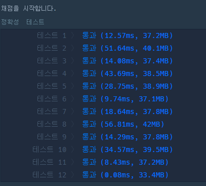
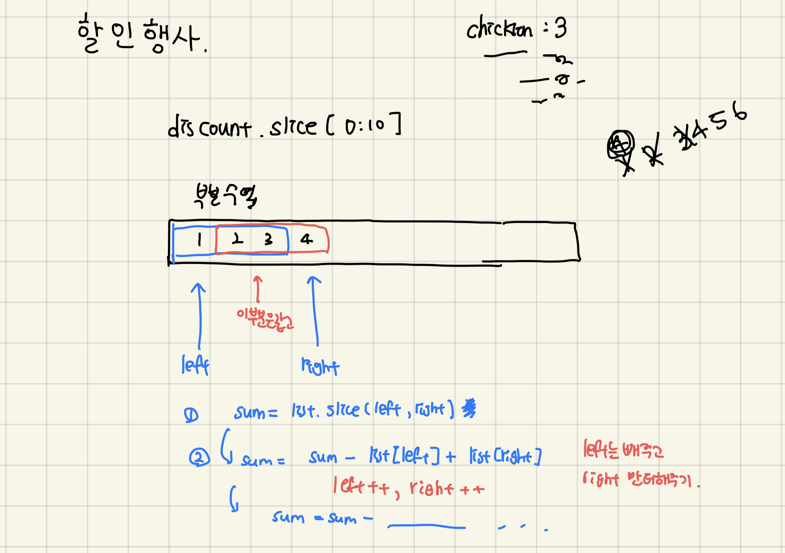
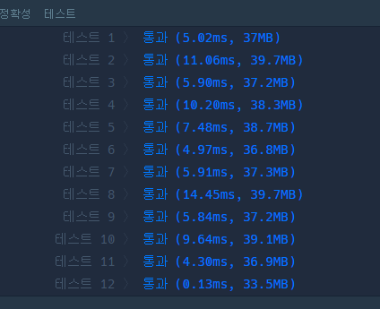

# [level 2] 할인 행사 - 131127 

[문제 링크](https://school.programmers.co.kr/learn/courses/30/lessons/131127) 

### 살펴볼 조건

- 항상 살 물건들은 10개로 고정이다.
- discount의 목록은 늘 10개 이상이므로 막 9일 밖에 없다거나 하는 현상은 없다.

### 알고리즘 생각

- 10개씩 slice해서 부분리스트를 만들고, 그 부분리스트를 객체나 map으로 만들어서 기존 want-number 물품과 개수를 비교하자
- 객체를 쓸까? Map?
    - 부분리스트로 매번 객체 만들어서 추가하려면 map이 더 편해보였음
- 객체 비교는 어떻게 할까?
    - object끼리 비교했을 때 요소가 같더라도 false가 뜸
    - want[i]의 개수는 number[i]에 있으므로, map에서 want[i]를 key로 찾아 number[i]와 비교
 

### 처음 작성한 코드

```javascript
function solution(want, number, discount) {
var answer = 0;

for(let i=0;i<=discount.length-10;i++) { // discount를 10개씩 slice하기 위한 범위
    let list = discount.slice(i,i+10);
    const map = new Map();
    //부분 리스트를 map으로 만들어준다.
    list.forEach(item=>map.set(item,(map.get(item)||0)+1));

    let check = true;
    for(let j = 0; j < want.length; j++){
        //만약 물품의 개수가 일치하지 않는다면
        if(map.get(want[j])!=number[j]) {
            check = false;
            break;
        }
    }
    if(check) answer++;  // 일치하면 정답
}
return answer;
}
```

### 실행 결과 




### 여기서 든 의문점…

- 매번 slice해서 부분리스트를 만들고 map변환하는게 속도와 용량을 많이 잡아먹는 작업인 것 같다…
- 혹시 더 줄일 방법이 없나?
- 부분수열의 합 구하는 방법이 급 떠오름



- 부분 수열의 합을 구할 때, 더 효율적으로 구하기 위해서는 중간에 겹치는 부분은 그대로 킵하고, 가장 왼쪽 요소 list[left]를 빼고, 가장 오른쪽 요소 list[right]를 더해준다.
- 처음에만
    - `sum = list.slice(left, right);`
- 그 다음부터는
    - `sum = sum - list[left] + list[right]; //기존 수열의 합 - 왼쪽요소 + 오른쪽요소`
    - `left++; right++; //포인터 이동`
- 쭉 반복… 그러면 매번 slice하는 것보다 더 효율이 좋음!!


### 속도가 더 향상된 버전 코드

```javascript
function solution(want, number, discount) {
    var answer = 0;

    let left =0;
    let right=10;
    const map = new Map();

    for(let i=0;i<=discount.length-10;i++) {
        if(i==0){ //처음에만 0~10범위 부분리스트를 map으로 만들어준다.
            let list = discount.slice(i,i+10);
            list.forEach(item=>map.set(item,(map.get(item)||0)+1));
        }
        else { //맨 앞 요소 삭제, 맨 뒤 요소 추가
            map.set(discount[left], map.get(discount[left])-1);
            map.set(discount[right], (map.get(discount[right])||0)+1);
            right++;
            left++;
        }

        let check = true;
        for(let j = 0; j < want.length; j++){
            //만약 물품의 개수가 일치하지 않는다면
            if(map.get(want[j])!=number[j]) {
                check = false;
                break;
            }
        }
        if(check) answer++;  // 일치하면 정답
    }
    return answer;
}
```

### 실행 결과



-> 속도가 개선된 걸 확인!
